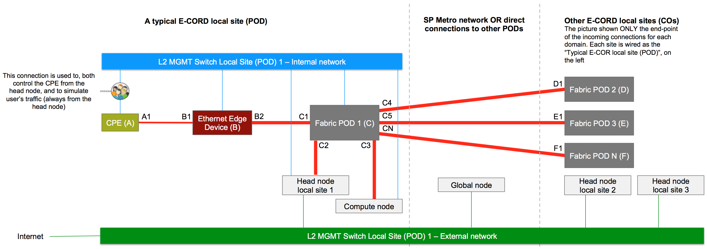

# Installation Guide

Installing E-CORD is based on the standard CORD
[installation process](https://guide.opencord.org/install_physical.html). This
section describes the additional steps required.

## Hardware Requirements (BOM)

Following is a list of hardware needed to create a typical E-CORD deployment. References will be often made to the generic CORD BOM.
 
> The hardware suggested is a reference implementation. Hardware listed have been usually used by ONF and its community for lab trials and deployments to validate the platform and demonstrate it's capabilities. You’re very welcome to replace any of the components and bring in yours into the ecosystem. As a community, we would be happy to acknowledge your contribution and put new tested devices in the BOM as well.

The following suggests specific hardware.

### Global Node

* 1x development machine - same model used for a [generic CORD POD](https://guide.opencord.org/install_physical.html#bill-of-materials-bom--hardware-requirements)
* 1x compute node (server) - same model used for a [generic CORD POD](https://guide.opencord.org/install_physical.html#bill-of-materials-bom--hardware-requirements)

### Local Site (POD)

The following hardware is required for each POD.

* Everything listed in the BOM of a generic CORD POD

> **WARNING**: Currently E-CORD does not support more than 1 fabric switch per 
> POD. While soon will be possible to use more than one fabric switch, it is useless now to buy more than a fabric switch per local site.

* 1x Centec v350, used as “Ethernet Edge switch”
* 1x CPE, composed by
    * 1x 2-port TP-Link Gigabit SFP Media converter, model MC220L(UN)
    * 1x Microsemi EA1000 programmable SFP
* 1x fiber cable (or DAC) to connect the CPE to the Ethernet Edge switch
* 1x 40G to 4x10G  QSFP+ module to connect the Ethernet Edge switch to the access leaf fabric switch (EdgeCore QSFP to 4x SFP+ DAC, model ET6402-10DAC-3M, part M0OEC6402T06Z)
 
> **NOTE**: The role of the CPE is to receive end-user traffic, tag it with a VLAN id, and forward it to the Ethernet Edge switch. Additionally, the CPE sends and receives OAM probes to let CORD monitor the status of the network. For lab trials, a combination of two components has been used to emulate the CPE functionalities: a media converter, used to collect users’ traffic from an Ethernet CAT5/6 interface (where a traditional host, like a laptop, is connected) and send it out from its other SFP interface; a programmable SFP (plugged into the SFP port of the media converter), that a) tags the traffic with a specific VLAN id and forwards it to the Ethernet Edge switch; b) sends and receives OEM probes to let CORD monitor the network. The programmable SFP is currently configured through NETCONF, using the ONOS Flow Rule abstraction translated into NETCONF XML for the drivers, and the ONOS-based CarrierEthernet application to generate the Flow Rules based on requests.

## Local Site Connectivity

The main CORD physical POD
[installation guide](https://guide.opencord.org/install_physical.html#connectivity-requirements)
already provides a basic POD connectivity diagram. These connections
are also needed to bring up an E-CORD local site. Carefully review them before going through this section.



### Legend
* **Red lines**: data plane connections
* **Light blue lines**: control plane connections
* **Bold (BOLD!) lines**: 10G/40G fiber network connections, depending on your hardware
* **Bold lines**: 1G fiber network connections
* **Thin lines**: 1G copper network connections

The diagram has been populated with letters and numbers that reference specific devices or ports. Letters only reference devices (i.e. A is the CPE). Letters and numbers reference a port. For example, A1 is the "fiber" port on the CPE.

* **A** - the CPE
* **B** - the the Ethernet Edge Device
* **B1** - the Ethernet Edge Device port facing the CPE
* **B2** - the Ethernet Edge Device port facing the fabric switch
* **C** - the fabric switch
* **C1** - the fabric switch port facing the Ethernet Edge Device
* **C2** - the fabric switch port facing the head node (if any)
* **C3** - the fabric switch port facing the compute node (if any)
* **C4** - the main fabric switch port connecting the POD to the upstream network (or directly to the fabric switch of the second POD)
* **C5** - the main fabric switch port connecting the POD to the upstream network (or directly to the fabric switch of the third POD)
* **E** - the remote fabric switch (of "POD2" in lab trials with 3 PODs)
* **E1** - the remote fabric switch port of "POD2", facing the fabric switch in POD1
* **F** - the remote fabric switch (of "POD3" in lab trials with 3 PODs)
* **F1** - the remote fabric switch port of "POD3", facing the fabric switch in POD1

A letter, plus "N" represents a generic port on a specific device.

## Installing the Global Node

To install the global node, you should follow the steps described in
the main
[physical POD installation](https://guide.opencord.org/install_physical.html). At
a high level, bootstrap the development machine and download the code.

### Global Node Configuration File

When it’s time to write your POD configuration, use the [physical-example.yml](https://github.com/opencord/cord/blob/master/podconfig/physical-example.yml) file as a template. Either modify it or make a copy of it in the same directory.
Fill in the configuration with your own head node data.

As `cord_scenario`, use `single`. This won’t install OpenStack and other software, which are not needed on the global node.

As `cord_profile`, use `ecord-global`.

### POD Build

Continue the installation as described in the standard installation guide by running the make build target:

```
make build
```

### DNS Services Restart

As soon as the procedure is finished you need to restart two services on the POD.

```
sudo service nsd restart
sudo service unbound restart
```

Now your global node is ready to be connected to the local sites.

## Installing an E-CORD Local Site

To install each local site you should follow the steps described in the
main
[physical POD installation](https://guide.opencord.org/install_physical.html). Bootstrap
the development machine and download the code.

When it’s time to write your POD configuration, use the [physical-example.yml](https://github.com/opencord/cord/blob/master/podconfig/physical-example.yml) file as a template. Either modify it or make a copy of it in the same directory.
Fill in the configuration with your own head node data.

As `cord_scenario` use `cord`.

As `cord_profile` use `ecord`.

## Configure the Global Node

It is essential to configure the global node properly, in order to
instruct it about the existing local sites, have them connected and
coordinated. Configuring the global node consists of two parts, an
XOS/Tosca configuration and an ONOS/JSON.

### Configuring XOS (Tosca Configuration)

The first part consists of instructing XOS running on the global node
about the set of local sites. To configure your XOS instance, do the following:
 
* Create your TOSCA file, using as template the file on your
  development/management machine, under
  *CORD_ROOT/orchestration/profiles/ecord/examples/vnaasglobal-service-reference.yaml*
  (available also online,
  [here](https://github.com/opencord/ecord/blob/master/examples/vnaasglobal-service-reference.yaml)).
  
  * Save it on the global node.
  
  * SSH into your global node.
  
  * On the global node, run the following command:
```
python /opt/cord/build/platform-install/scripts/run_tosca.py 9000 xosadmin@opencord.org YOUR_XOS_PASSWORD PATH_TO_YOUR_TOSCA FILE
```

>**NOTE**: If the XOS password has been auto-generated, you can find it on the global node, in 
```
/opt/credentials/xosadmin@opencord.org
```

### Configuring ONOS (JSON Configuration)

To configure ONOS on the global node:
* SSH into the global node.
* Login to ONOS_CORD: *ssh -p 8102 onos@onos-cord*.
* In the ONOS CLI (*onos>*) verify that apps are loaded by executing: `apps -a -s`
    The following applications should be enabled:
    ```
    org.onosproject.drivers
    org.opencord.ce-api
    org.opencord.ce.global
    ```
    If one or more apps mentioned above are not present in the list, they can be activated with `app activate APP-NAME`.
* Logout from ONOS (CTRL+D or exit)
* Anywhere, either on the global node itself or on any machine able to reach the global node, write your ONOS configuration file. The following is an example configuration for a global node that communicates with two local sites, with domain names site1 and site2.
    
    ```
    {
      "apps" : {
        "org.opencord.ce.global.vprovider" : {
          "xos" : {
            "username" : "xosadmin@opencord.org",
            "password" : "YOUR_XOS_PASSWORD (see note below)",
            "address" : "YOUR_GLOBAL_NODE_IP",
            "resource" : "/xosapi/v1/vnaas/usernetworkinterfaces/"
          }
        },
        "org.opencord.ce.global.channel.http" : {
          "endPoints" : {
            "port" : "8182",
            "topics" : [
              "ecord-domains-topic-one"
            ],
            "domains" :
            [
              {
                "domainId" : "YOUR-SITE1-EXTERNAL-IP-fabric-onos",
                "publicIp" : "YOUR-SITE1-EXTERNAL-IP",
                "port" : "8181",
                "username" : "onos",
                "password" : "rocks",
                "topic" : "ecord-domains-topic-one"
              },
              {
                "domainId" : "YOUR-SITE1-EXTERNAL-IP-cord-onos",
                "publicIp" : "YOUR-SITE1-EXTERNAL-IP",
                "port" : "8182",
                "username" : "onos",
                "password" : "rocks",
                "topic" : "ecord-domains-topic-one"
              },
              {
                "domainId" : "YOUR-SITE2-EXTERNAL-IP-fabric-onos",
                "publicIp" : "YOUR-SITE2-EXTERNAL-IP",
                "port" : "8181",
                "username" : "onos",
                "password" : "rocks",
                "topic" : "ecord-domains-topic-one"
              },
              {
                "domainId" : "YOUR-SITE2-EXTERNAL-IP-cord-onos",
                "publicIp" : "YOUR-SITE2-EXTERNAL-IP",
                "port" : "8182",
                "username" : "onos",
                "password" : "rocks",
                "topic" : "ecord-domains-topic-one"
              }
            ]
          }
        }
      }
    }
    ```
    
> **NOTE** Under the key “topics” you can specify as many topics (string of your choice) as you prefer for sake of load balancing the communication with the underlying (local-site) controllers among the instance of the global ONOS cluster. For each domain you also have to specify one of these topics.
    
> **NOTE**: If the XOS password has been auto-generated, you can find it on the global node, in /opt/credentials/xosadmin@opencord.org

* Use CURL to push your file:
    ```
    curl -X POST -H "content-type:application/json"  http://YOUR-GLOBAL-NODE-IP:8182/onos/v1/network/configuration -d @YOUR-JSON-FILE.json --user onos:rocks
    ```

## Configure the Local Sites

Local sites configuration consists of four parts:
* Ethernet Edge (Centec V350) configuration
* Fabric Breakout configuration (optional)
* ONOS_Fabric configuration
* The ONOS_CORD configuration

### Configure the Ethernet Edge device - B - (Centec v350)

The steps below assume that
* The Centec device to an A(Access)-leaf fabric switch
* ONOS_CORD is running

Follow the steps below to assign an IP address to the Ethernet Edge device and connect it to ONOS_CORD.

#### Set a Management IP Address on the Switch OOB Interface

The switch management interface should be set with a static IP address (DHCP not supported yet), in the same subnet of the POD internal/management network (by default 10.6.0.0/24).

> **NOTE**: Please, use high values for the IP last octet, since lower values are usually allocated first by the MAAS DHCP server running on the head node.

To configure the static IP address, do the following:
* Log into the CLI of the Centec switch (through SSH or console cable)
* *configure terminal*
* *management ip address YOUR_MGMT_ADDRESS netmask YOUR_NETMASK*
* *end*
* *show management ip address*

### **Optional** Configure the Breakout Cable on the Fabric Switch

If you use a fabric switch with 40G interfaces and a 4 x 10G breakout
cable to connect to the Centec Etherned Edge, you need to properly configure
the interface on which the breakout cable is connected.

By default, all 32 ports are running in 1 x 40G mode. The `/etc/accton/ofdpa.conf` needs to be modified to break out 1 x 40G into 4 x 10G.
Do the following:
* ssh into the fabric switch (username and password are usually root/onl)
* `vi /etc/accton/ofdpa.conf`
* uncomment this line `port_mode_1=4x10g    # front port 1` for the port you have the breakout cable connected to
* save the file and exit from it. 
* `cd ~`
* `./killit`
* `./connect -bg`

For any more reference you can go to this particular step [Fabric configuration guide](https://wiki.opencord.org/display/CORD/Hardware+Switch+Installation+Guide#HardwareSwitchInstallationGuide-C3)

### Set ONOS-CORD as the Openflow Controller

To set ONOS-CORD as the default switch OpenFlow controller and verify the configuration:
* Log into the CLI of the Centec switch (through SSH or console cable)
* *configure terminal*
* *openflow set controller tcp YOUR-LOCAL-SITE-HEAD-IP 6654*
* *end*
* *show openflow controller status*
 
The local site configurations explained below need to happen on the head nodes of all local sites.

### ONOS_Fabric Configuration

ONOS_Fabric manages the underlay network (the connectivity between the fabric switches).

To configure ONOS_Fabric do the following:
* SSH on the local site head node
* Log into ONOS_Fabric: `ssh -p 8101 onos@onos-fabric`
* In the ONOS CLI (*onos>*) verify that apps are loaded: `apps -a -s`
    The list of applications enabled should include:
    ```
    org.onosproject.segmentrouting
    org.opencord.ce.api
    org.opencord.ce.local.bigswitch
    org.opencord.ce.local.channel.http
    org.opencord.ce.local.fabric
    ```
    If one or more apps mentioned above are not present in the list, they can be activated with `app activate APP-NAME`
    * Check that the site domain id is correctly set in ONOS, running
    ```
    cfg get org.opencord.ce.local.bigswitch.BigSwitchManager
    ```
    The value should be `YOUR-HEAD-NODE-IP-fabric-onos`
* Check that the fabric switch is connected to onos typing devices. If no devices are there, make sure your fabric switch is connected to ONOS and go through the [Fabric configuration guide](https://guide.opencord.org/appendix_basic_config.html#connect-the-fabric-switches-to-onos).
* Logout from ONOS (CTRL+D or exit)
* Anywhere, either on the head node itself or on any machine able to reach the head node, write your ONOS configuration file.
    Following, is an example configuration for a local site.
    
    ```
    {
      "apps" : {
        "org.opencord.ce.local.fabric" : {
          "segmentrouting_ctl": {
            "publicIp": "YOUR-HEAD-NODE-IP",
            "port": "8181",
            "username": "onos",
            "password": "rocks",
            "deviceId": "of:C-DPID"
          }
        },
        "org.opencord.ce.local.bigswitch" : {
          "mefPorts" :
          [
            {
              "mefPortType" : "INNI",
              "connectPoint" : "of:C-DPID/C1",
              "interlinkId" : "EE-1-to-fabric"
            },
            {
              "mefPortType" : "ENNI",
              "connectPoint" : "of:C-DPID/C4 (duplicate as many time as needed, depending how many uplink / connections to other PODs you have)",
              "interlinkId" : "fabric-1-to-fabric-2"
            }
          ]
        },
        "org.opencord.ce.local.channel.http" : {
          "global" : {
            "publicIp" : "YOUR-GLOBAL-NODE-IP",
            "port" : "8182",
            "username" : "onos",
            "password" : "rocks",
            "topic" : "ecord-domains-topic-one"
          }
        }
      }
    }
    ```

* Use CURL to push your file
    ```
    curl -X POST -H "content-type:application/json"  http://YOUR-LOCAL-HEAD-NODE-IP:8181/onos/v1/network/configuration -d @YOUR-JSON-FILE.json --user onos:rocks
    ```

#### MEF Ports

Under the key `mefPorts` there is the list of physical ports that have to be exposed to the global node. These ports represent MEF ports and can belong to different physical devices, but they will be part of a single abstract “bigswitch” in the topology of the global ONOS (see [E-CORD topology abstraction](https://guide.opencord.org/profiles/ecord/overview.html#e-cord-topology-abstraction)). These ports represent also the boundary between physical topologies controlled by different ONOS controllers.

In the Json above:
* *of:C-DPID/C1* is the DPID and the port of the fabric device where the Ethernet Edge Device is connected to. 
* *of:C-DPID/C4* is the DPID and the port of the fabric device where the transport network is connected to (in the example fabric switches are connected together). 

This is hinted through the `interlinkId` value.

#### Topic Attribute

The `topic` attribute under the `org.opencord.ce.local.channel.http` is a string of your choice. It is used to run an election in an ONOS cluster to choose the ONOS instance that interacts with the global node.

### ONOS_CORD Configuration

ONOS_CORD manages the overlay network. It controls both the users'
CPEs and the Ethernet Edge devices.

The programmable microsemi SFP -part of your emulated CPE- is
configured and managed through Netconf (more information about NETCONF
and ONOS can be found
[here](https://wiki.onosproject.org/display/ONOS/NETCONF)).

The Ethernet Edge device is managed through OpenFlow.
Both the devices, at the end of the configuration procedure should
show up in ONOS_CORD, which can be confirmed by typing `devices` in the ONOS CLI (*onos>*).

To configure ONOS_CORD do the following:
* SSH into the head node
* Login to onos-cord: `ssh -p 8102 onos@onos-cord`
* At the ONOS CLI verify that apps are loaded: `apps -a -s`
    The following applications should be enabled:
    ```
    org.onosproject.drivers.microsemi
    org.onosproject.cfm
    org.opencord.ce.api
    org.opencord.ce.local.bigswitch
    org.opencord.ce.local.channel.http
    org.opencord.ce.local.vee
    ```
    If one or more apps mentioned above are not present in the list, they can be activated with app activate APP-NAME
* Create a new JSON file and write your configuration. As a template, you can use the JSON below:
    ```
    {
     "devices": {
      "netconf:YOUR-CPE-IP:830": {
       "netconf": {
         "username": "admin",
         "password": "admin",
         "ip": "A-IP",
         "port": "830"
       },
       "basic": {
        "driver": "microsemi-netconf",
        "type": "SWITCH",
        "manufacturer": "Microsemi",
        "hwVersion": "EA1000"
       }
      }
     },
     "links": {
      "netconf:A-IP:830/0-of:B-DPID/B1" : {
       "basic" : {
        "type" : "DIRECT"
       }
      },
      "of:B-DPID/B1-netconf:A-IP:830/0" : {
       "basic" : {
        "type" : "DIRECT"
       }
      }
     },
     "apps" : {
      "org.opencord.ce.local.bigswitch" : {
       "mefPorts" :
        [
         {
          "mefPortType" : "UNI",
          "connectPoint" : "netconf:A-IP:830/0"
         },
         {
          "mefPortType" : "INNI",
          "connectPoint" : "of:B-DPID",
          "interlinkId" : "EE-2-fabric"
         }
        ]
      },
      "org.opencord.ce.local.channel.http" : {
       "global" : {
        "publicIp" : "YOUR-GLOBAL-NODE-IP",
        "port" : "8182",
        "username" : "onos",
        "password" : "rocks",
        "topic" : "ecord-domains-topic-one"
       }
      }
     }
    }
    ```
* Load the following the Json file just created using curl:
    ```
    curl -X POST -H "content-type:application/json" http://YOUR-LOCAL-SITE-HEAD-IP:8182/onos/v1/network/configuration -d @YOUR-JSON-FILE.json --user onos:rocks
    ```

> **Warning** The JSON above tries to configure devices and links at the same time. It may happen that ONOS denies your request of link creation, since it does not find devices present (because their creation is still in progress). If this happens, just wait few seconds and try to push again the same configuration, using the *curl* command above.

# Done!
After the global node and the local sites are properly configured, the global node should maintain an abstract view of the topology and you should see UNIs distributed on the map of the XoS GUI. You can start requests to setup Ethernet Virtual Circuit (EVC) from XoS.

# Demo: Create an E-Line Using the GUI

* SSH into global node
* From */opt/credentials/xosadmin@opencord.org* copy the XOS password
* From a computer, able to reach the global node, open a browser and go to *http://YOUR_GLOBAL_NODE_IP/xos*
* Use the following username/password to access:
    * Username: `xosadmin@opencord.org`
    * Password: YOUR_PASSWORD_COPIED_AT_THE_STEP_BEFORE
* From the left menu of the XOS UI, choose `VNaaS GUI`
* You should see CORD symbols on the map (your UNIs / end-points)
    * Click on one of them
    * Choose “Create connection”
* From the right menu
    * Choose the bandwidth profile you prefer (i.e. “Gold”)
    * Input a CORD Site name (i.e. test demo)
    * Input a VLAN id (i.e. 100)
* Click on another CORD symbol
* Click “Finish connection”. This will populate the field “Connect point 2 ID” in the right menu
* Click save changes on the right menu

A line should appear between the two icons, meaning that a request to connect the two end-points has been saved. The line should become green in few seconds. Green lines are good signs of a working environment.

## End-Point Communication

You should now be able to let communicate together the two end-points
connected to the CPEs. Each of the two end-points need to be
configured to send-out packets tagged with the same VLAN Id(s).

Assuming you just configured VLAN id 100 in the UI, and that the two end-points will communicate together using the 192.168.1.0/24 subnet, on each head do the following:
* *apt-get install vlan*
* *sudo modprobe 8021q*
* Activate by default at startup the vlan module
* *sudo  sh -c 'grep -q 8021q /etc/modules || echo 8021q >> /etc/modules'*
* *vi /etc/network/interfaces* and add an alias, VLAN tagged interface
    ```
	auto YOUR_INTERFACE_CONNECTED_TO_INTERNAL_NETWORK.100
	iface YOUR_INTERFACE_CONNECTED_TO_INTERNAL_NETWORK.100 inet static
	address 192.168.1.1 (for the first head node, or 2 for the second one)
	netmask 255.255.255.0
	```
* Save
* Bring up the interface with *sudo ifup YOUR_INTERFACE_CONNECTED_TO_THE_CPE.100*

## Success: Ping!
If everything works fine, the two hosts should be able to ping one each other.
