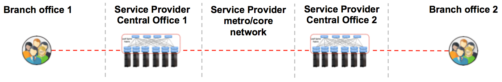
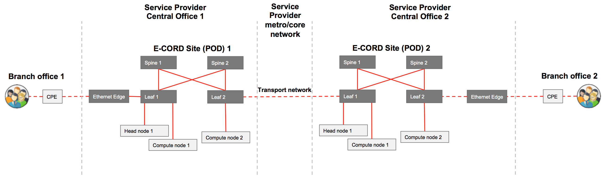
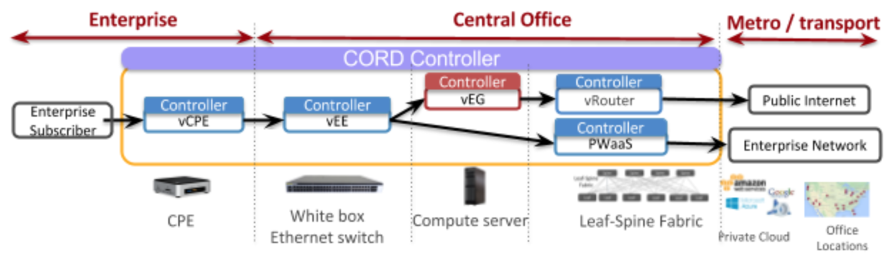
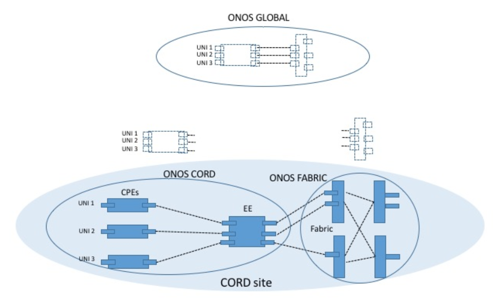
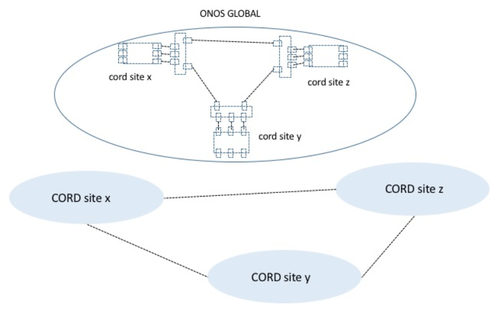

# What is E-CORD?

Enterprise CORD (E-CORD) is a CORD use case that offers enterprise connectivity
services over metro and wide area networks, using open source software and
commodity hardware.

E-CORD builds on the CORD platform to support enterprise customers, and allows
Service Providers to offer enterprise connectivity services (L2 and L3VPN).  It
can also go beyond these simple connectivity services to include Virtual
Network Functions (VNFs) and service composition capabilities to support
disruptive cloud-based enterprise services.

Enterprise customers can use E-CORD to rapidly create on-demand networks
between any number of endpoints or company branches. These networks are
dynamically configurable, implying connection attributes and SLAs can be
specified and provisioned on the fly. Furthermore, enterprise customers may
choose to run network functions such as firewalls, WAN accelerators, traffic
analytic tools, virtual routers, etc. as on-demand services that are
provisioned and maintained inside the service provider network.

## Glossary

The section provides a list of the basic terms used in E-CORD

* **Local POD**: Each local CORD POD (also identified in the guide as an E-CORD
  site) is a standard CORD POD equipped with specific access equipment.  It is
  usually located in the Service Provider’s Central Offices and is mainly used
  to: 1) connect the enterprise user to the Service Provider network; and 2)
  run value added user services (e.g., firewalls, traffic analytic tools, WAN
  accelerators) at the edge of the network, close to the enterprise sites.
  Upstream, the POD usually connects to the Service Provider metro/transport
  network or to the public internet.

* **Global Node**: The global node is a single machine running either in the
  cloud, or in any other part of the Service Provider network, used to
  coordinate connectivity and services among all the local PODs of the E-CORD
  deployment. It consists of an instance of XOS (global orchestrator) and ONOS
  (controlling the transport network interconnecting edge sites).

## System Overview

A typical E-CORD deployment is made of one global node and multiple (minimum
two) CORD sites (PODs), connected to the same transport network.

Each site is a standard CORD POD comprised of one or more compute nodes, and
one or more fabric switches. The transport network provides connectivity
between the CORD sites. It can be anything from a converged packet-optical
network, to a single packet switch for demo purposes. The transport network can
be composed of white-box switches, legacy equipment, or a mix of both. The
minimum requirement in order to deploy E-CORD is to provide Layer 2
connectivity between the PODs, specifically between the leaf fabric switches
that face the upstream/metro network of the COs.

> NOTE: Usually, for lab trials, the leaf switches of the two sites (PODs) are
> connected directly through a cable, or through a legacy L2 switch.

### Global Node

The global node is responsible for orchestrating users’ requests and to manage
the connectivity and the services provisioning. It runs only an instance of XOS
and an instance of ONOS (specifically ONOS_CORD). The ONOS instance (ONOS_CORD)
manages the end-to-end traffic forwarded between the sites.

The global ONOS is composed of three modules:

* **Carrier Ethernet Orchestrator**: Exposes a Northbound REST interface to
  receive requests to create Ethernet Virtual Circuits (EVCs).

* **Virtual Provider**: Manages the abstract view of the local E-CORD sites
  topologies.

* **Global HTTP Channel**: Supports communication with the local sites.

### Local Sites

Local sites are responsible for collecting users’ traffic and forwarding it
either to other local sites or to the Internet. Each local site comes with two
ONOS controllers that are part of the reference architecture of CORD: ONOS_CORD
and ONOS_Fabric. The Carrier Ethernet application of E-CORD uses both
controllers to provision the physical network:

* **ONOS_CORD**: Runs the application that controls the edge access, including
  the CPE devices and the Ethernet Edge (EE) devices.

* **ONOS_Fabric**: Runs the application configuring the cross connections
  within the fabric of CORD, to bridge the CPEs to the transport network and to
  the remote sites.

The following components are added to ONOS_CORD:

* CE-API
* Bigswitch service
* HTTP channel
* CE-VEE

The following components are added to ONOS_Fabric:

* CE-API
* Bigswitch service
* HTTP channel
* CE-fabric

The CE-API, the bigswitch service, and the HTTP channel are common to both
ONOS_CORD and ONOS_Fabric. They are used to put in communication the ONOS
running on the global node  and the ones running on the local sites.

The local sites abstract their network topology and expose it to the global
node. They receive requests from the global ONOS, and provision the network for
the EVCs setup.

### Service Graph

The global node implements a single service called **vNaaS** (**virtual Network
as a Service**) that is responsible for controlling end-to-end connectivity
between the PODs.

Each local site implements multiple services that collectively control the
underlying hardware and software, and are thus able to connect the Enterprise
Subscriber from the edge of the Central Office to the upstream network.

A representation of the default E-CORD local site service graph is shown below.

The local graph consists of five different services with different responsibilities.

* **vCPE (Virtual Customer Premise Equipment)**: Inserts an 802.1ad (QinQ)
  header to the upstream packets of an Enterprise Subscriber and removes it
  for downstream flows. Packets are tagged with a vlanId (the Service Provider
  tag, s-tag) and then forwarded to the Ethernet Edge. The s-tag is
  associated with one or more c-tag (customer tags, the vlanId of the 802.1q
  protocol) to isolate the traffic within the Service Provider network. The
  vCPE function is very similar to that of vOLT in R-CORD.

* **vEE (Virtual Ethernet Edge)**: Aggregates traffic from multiple customers
  with CPEs and applies policing and forwarding to the fabric. The vEE is also
  responsible for making routing decisions on the traffic. The vEE filters the
  traffic meant for the enterprise network and sends it through pseudo-wire in
  the fabric directly to the transport network and the other enterprise
  branch. If the vEE recognizes that the traffic is instead meant for the
  public Internet, it will send it to the vEG and then to the vRouter.

* **vEG (Virtual Enterprise Gateway)**: Runs selected VNFs, such as bandwidth
  metering, firewall, diagnostics etc, and possibly forwards the traffic to
  the vRouter.

* **vRouter (Virtual Router)**: Responsible for sending traffic out of the
  CORD POD to the public Internet. It is the same service that is present in
  the R-CORD service chain. More information about it can be found
  [here](/vrouter.md#connecting-to-upstream-networks-using-vrouter).

* **PWaaS**: Enables a “pass-through”** in the leaf-spine fabric, allowing
  traffic to directly go out to the metro network. This is done through a
  configuration of the segment routing application.

## Topology Abstraction

The global node maintains an abstract view of the underlying topology for the
sake of scalability and to separate domain-specific and domain-agnostic
concerns. Note that in a single CORD POD there are two independent ONOS
controllers: ONOS_CORD and ONOS_Fabric. For each local site, the E-CORD
application exposes two abstract devices to the global node: one is exposed by
the ONOS_CORD and the other by the ONOS_Fabric. They represent an aggregation
of the real network elements that compose the topology of a local site.

The picture below shows how the two topologies get abstracted and exposed to
the ONOS instance running on the global node.

In this way, the global ONOS has fewer devices and link data structures to deal
with. Path computation involves only these aggregated items, while the actual
network provisioning is achieved by the local site controllers.

The relevant topology information for the global node include

* **User-to-Network Interfaces (UNIs)**: See [MEF
  specs](https://www.mef.net/resources/technical-specifications).

* **Network-to-Network Interfaces (NNIs)**: See [MEF
  specs](https://www.mef.net/resources/technical-specifications).

* **Associated bandwidth capacities**: For admission control.

The NNI ports are annotated with an inter-link identifier (`interlinkId`) so
that the global node can understand which ports are at the ends of which
inter-domain links.

The inter-domain link connects to devices controlled by different ONOS
controllers at local level. See the ONOS_FABRIC and ONOS_CORD json
configuration sections in the installation guide for more examples,

